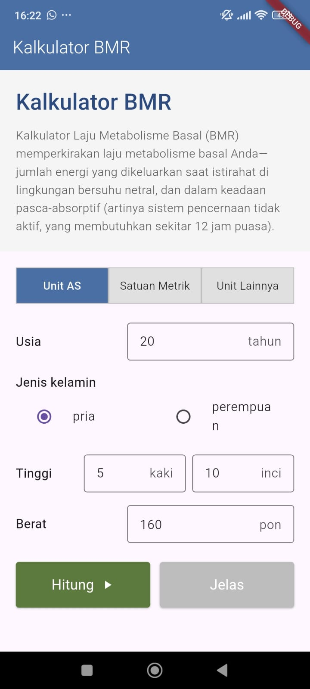

# FLUTTER_KELOMPOK_KAMI

## Tampilan Aplikasi

  

---

## Nama Kelompok

- *Ardhian Purnomo (K3523016)*
- *Muhammad Abdul Aziz Al-Amiri (K3523046)*
- *Rayhan Rosyad (K3523062)*

---

## Deskripsi Project
Aplikasi Kalkulator BMR (Basal Metabolic Rate) ini dibuat untuk membantu pengguna menghitung jumlah kalori minimal yang dibutuhkan tubuh untuk menjalankan fungsi dasar dalam keadaan istirahat total. Perhitungan BMR sangat penting bagi siapa saja yang ingin:

Menurunkan berat badan
Menambah berat badan
Menjaga pola makan sehat
Menentukan kebutuhan kalori harian

---

